# Checkpoint19_Robot_Arm_Kinematics

## Task 1

Terminal 1

```
cd ~/catkin_ws
rosrun antropomorphic_project generate_matrixes.py
```

Result

A01.png

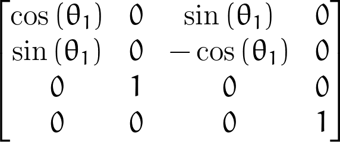

A12.png

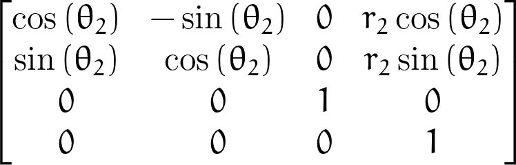

A23.png

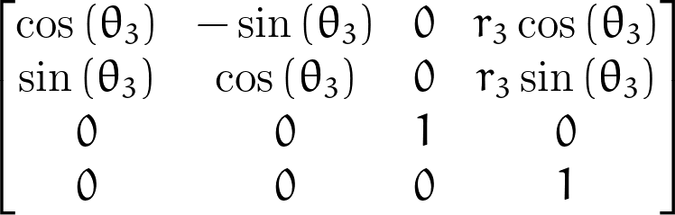

A03.png

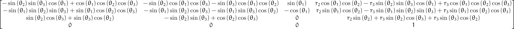

A03_simplify.png

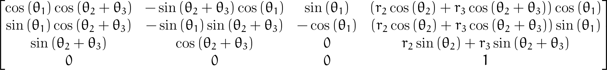

## Task 2

Terminal 1
```
rosrun antropomorphic_project fk_antropomorphic_arm.py
```

Enter the following values

```
theta1 = 2.356194490192345
theta2 = 0.5074842211955768
theta3 = -2.2459278597319283
```

Result

A03_simplify_evaluated.png

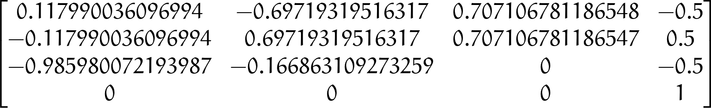

## Task 3

Result

Solution 1

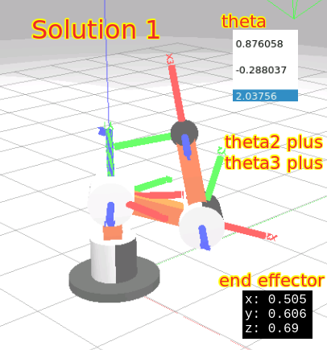

Solution 2

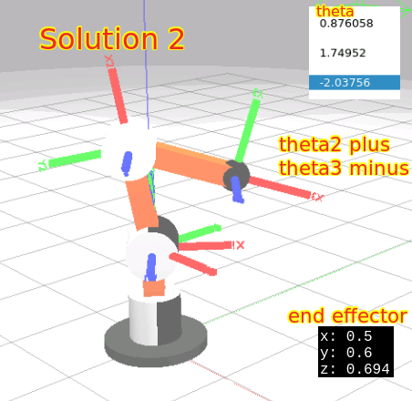

Solution 3

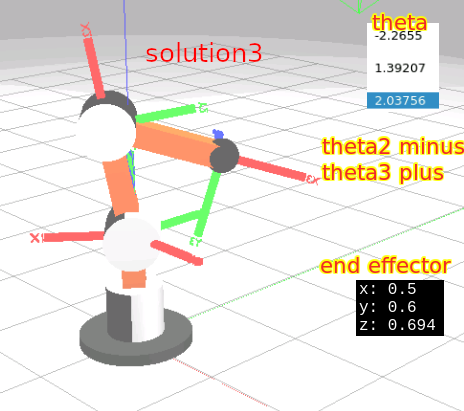

Solution 4: Impossible

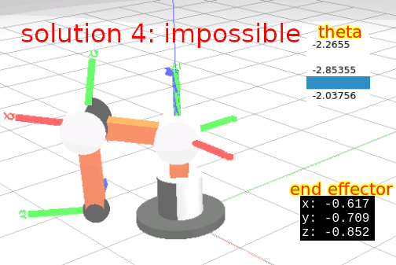

As a comparison, all thetas = zeros forward kinematic 

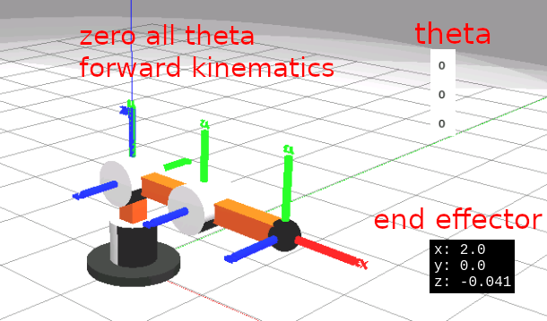

Terminal 1

```
source ~/simulation_ws/devel/setup.bash

roslaunch antropomorphic_arm_gazebo main.launch
```

Terminal 2

```
cd catkin_ws
rosrun antropomorphic_project ik_antropomorphic_arm.py
```


Terminal 3

```
roslaunch antropomorphic_arm_control antropomorphic_arm_sim_rqt.launch
```
and input values from Terminal 2.

Terminal 4: Check Result
```
rostopic echo /end_effector_real_pose
```

Note: The formula is from the book

- Robotics: Modelling, Planning and Control (Advanced Textbooks in Control and Signal Processing) 2009th Edition
by Bruno Siciliano (Author), Lorenzo Sciavicco (Author), Luigi Villani (Author), Giuseppe Oriolo (Author)


## Task 4

Terminal 1

```
source ~/simulation_ws/devel/setup.bash
roslaunch antropomorphic_arm_gazebo main.launch
```

Terminal 2

```
rosrun rviz rviz -d /home/user/simulation_ws/src/planar_3dof_kinematics/antropomorphic_arm_description/rviz/antropomorphic_3dof.rviz
```

Terminal 3

```
roslaunch antropomorphic_project start_elipsoidal_motion.launch
```

Helper commands

to run roslaunch antropomorphic_project start_elipsoidal_motion.launch   file one by one

Terminal 3.1

```
rosrun antropomorphic_project elipsoidal_motion.py
```

Terminal 3.2

```
rosrun antropomorphic_project antropomorphic_end_effector_mover.py
```